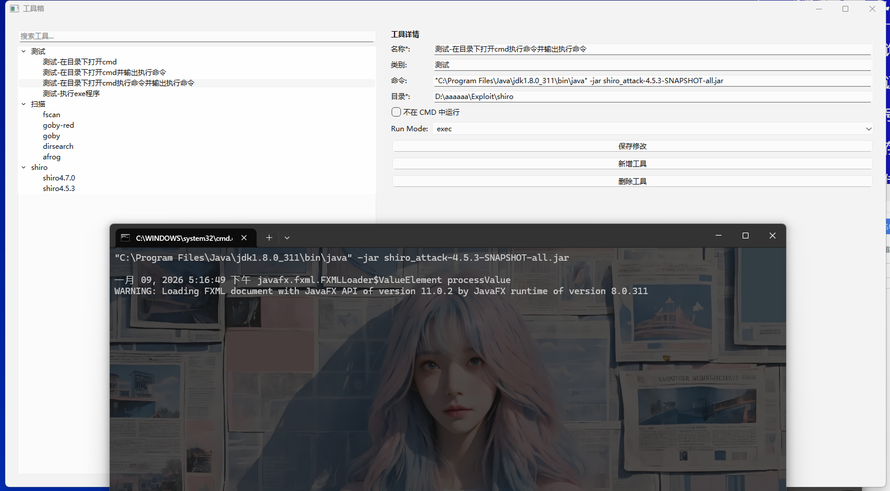
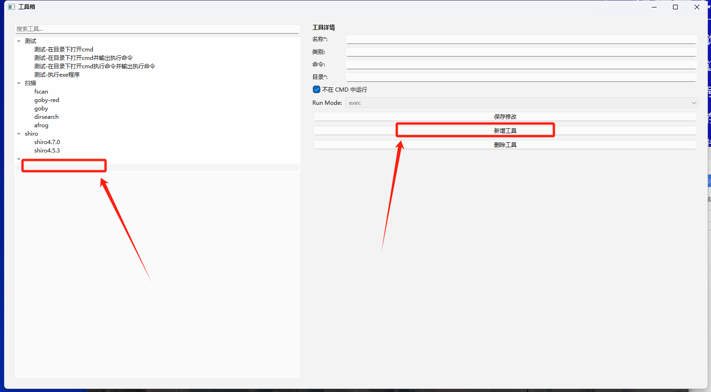

# Desktop_Toolbox

渗透测试工具太多，启动方式也千奇百怪，长时间不使用会忘记使用方式，本工具意在解决这个问题

程序的逻辑主要存储在`config.json`配置文件中，如移动请将`config.json`一起移走，否则配置会丢失

## 1、没有参数直接启动的exe


```
名称：自定义名称
类别：用于分类
命令：exe启动方式为【程序名.exe】
不在CMD中运行：即不打开cmd，和直接在目录中双击exe文件同理
```

## 2、在程序目录下打开cmd

有些程序运行时，我们会在程序目录下打开cmd，添加参数运行或为了获取运行日志。


```
名称：自定义名称
类别：用于分类
命令：为空则不执行任何命令
```

双击效果


## 3、在2的基础上，添加命令的备注


```
名称：自定义名称
类别：用于分类
命令：即在cmd中执行的命令
不在CMD中运行：即不打开cmd，和直接在目录中双击exe文件同理，不够选为打开命令行
Run Mode：echo为只输出，不执行
```

## 4、在3的基础上，执行并输出备注



```
名称：自定义名称
类别：用于分类
命令：即在cmd中执行的命令
不在CMD中运行：即不打开cmd，和直接在目录中双击exe文件同理，不够选为打开命令行
Run Mode：exec为执行并输出
```

# FAQ

## v1.0

目前版本问题，新增工具时，不会直接弹出空白工具详情，需要在最下边点击才可以


